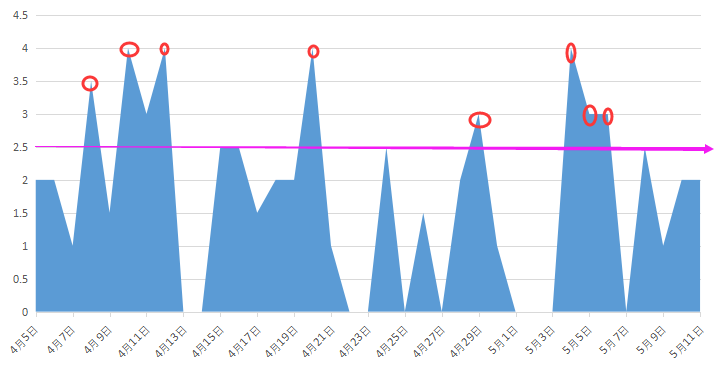

# 项目总结

课程总时长（一期+二期）：24.4小时

实际用时：64小时（2.6倍）

实际花费天数：37天（实际学习27天，实际体息10天）

实际平均每天2.37小时（以实际学习27天算）

实际用时图表：

总结：

1. 假设：64小时按正常上下班作息学习，每天2.5小时学时算：花费天数为36天（26天学习时间，10天休息）。==与实际用时差距不大。但是做的还不好，只算鸡肋，不上不下==。因为这只相当于在周一至周五每天学习2.5小时就完事了，没考虑到在这期间的超水平学习，完全可以缩短5天左右，也即只需要花29天（21天学习时间，8天休息时间）
2. 以后可以将每天时间标准定为3小时来学习

# 项目分析

## **目的**

- [x] 了解ssr与vue纯前端区别
- [x] 在使用Vue开发出页面的前提下，熟练用css修饰页面，将前端成品做出来
- [x] 跟着学习独自完成当前这个APP的构造

## **目标**

1. 完成饿了么APP

## **项目周期与方式**

1. 项目周期

   - 上次项目总时长17小时，最后花费时间45小时，持续天数34天

   - 本次项目一期总时长17小时，二期总时长7小时，以一期算预计花费45小时（另：还需要看二期教程因此可能多花费7+小时）

     - 预计1：花费天数为18天（周六周末休息总计8天，共26天，无爆发）

     - 预计2：花费天数为14天（周六周末休息总计6天，共20天，有爆发）

   - <!--预计花费36小时完成本次项目，持续时间12(有爆发) ~ 15(无爆发)，最后算上周六周天休息，租后预计花费天数为18 ~ 21天~~-->

     > <!--废弃原因：以二期7小时来算的，实际上应按照一期17小时来算。-->
     >
     > <!--理性分析了下，确实是我考虑不周，并不是为自己延期找妥协的理由-->

     - <!--本次项目一期7小时，预计花费18小时。-->
     - <!--因需要参考一期课程学习CSS，再预计花费18小时。-->

2. 计划方式

   1. 每天最低花费2.5小时，随机爆发（以最低30%算）。保证相对轻松，压力小。

   2. ==计划越长就越脆弱，中间随机调整即可重点保证达到目的的前提下保证时间==

# **项目计划**

- [x] **4-5 ~ 4-10：导学、准备工作、头部组件开发** ==超期== ==遗留问题==
- [x] **4-11：Tab组件开发，页面骨架**
- [x] **4-12 ~ 4-17：17商品列表页开发**
- [x] **4-18 ~ 4-22：18商品详情页开发** ==遗留问题==
- [x] **4-23：19评价列表页开发**
- [x] **4-24 ~ 4-26：20商家详情页**
- [x] **create-api，打包，部署**

## 打卡

 红色   蓝色   黄色   绿色   灰色 

4月

| 星期天 | 星期一 | 星期二 | 星期三 | 星期四 | 星期五 | 星期六 |
| :----: | :----: | :----: | :----: | :----: | :----: | :----: |
|        | 1 |   2    |   3    |   4   |  5  START  |  6  |
|  7  |  8  |  1  |  10  |  11  |  12  |  13  |
|  14  |  15  |  16  |  17  |  18  |  19  |  20  |
|  21  |  22  |  23  |  24  |  25  |  26  |  27  预期结束  |
|  28  |  29  |  30  |  |  |  |  |

5月

| 星期天 | 星期一 | 星期二 | 星期三 | 星期四 | 星期五 | 星期六 |
| :----: | :----: | :----: | :----: | :----: | :----: | :----: |
|  |      |      |  1  |  2  |  3  |  4  |
|  5  |  6  |  7  |  8  |  9  |  10  |  11  实际结束  |

​	

# 项目进度

## 4-5 ~ 4-10 导学、准备工作、头部组件开发

> 项目时长：6小时（一期）+ 1.5小时（二期）= 7.5小时
>
> 实际用时：15.5小时
>
> - [x] 4-5：2小时
> - [x] 4-6：2小时
> - [x] 4-7：1小时
> - [x] 4-8：3.5小时
> - [x] 4-9：1.5小时
> - [x] 4-10：2小时
>    - [x] 4-10：重新计划（2小时）
> - [x] 4-11：1.5小时
> - [ ] 遗留问题
>    - [ ] 商家详情展示页

- [ ] 4-5 ~ 4-6：导学、准备工作、头部组件开发
  - [x] 项目准备、买课程、规划课程（4-5，1小时）

  - [x] 1章 导学（4-5，5分）

  - [x] 2章 项目准备工作
    - [x] 看完二期课程理清思路（4-5，26分）
       - [x] 附加：看一期相关教程（4-5，33分）（4-6，1小时30分）
    - [x] 安装Vue项目及Cube-ui
    - [x] 配置Mock数据并能从前端请求到数据（4-6，44分）

  - [x] 3章 头部组件开发
    - [x] 看二期教程理清思路（4-8，35分）
      - [x] 附加：看一期相关教程（4-7，1小时）（4-8，25分）
      - [x] 附加：看Flex布局教程（4-9，30分）
    - [x] 配置图标字体（4-8，15分）
    - [x] 搭建头部框架及样式（4-8，2小时17分）
       - [x] 公告栏框架及css样式
          - [x] 公告文字超出省略显示效果
       - [x] 对不同dpi设备应用不同图片（4-9，1小时）
    - [x] 请求数据并填充相应组件
       - [x] 编写获取数据api
       - [x] 请求seller数据，并填充到结构中（4-10，53分）
       - [x] 完成suportIcon的显示（4-10，20分）
       - [x] 完成背景图模糊（4-10，3分）
    - [ ] 详情弹出页
       - [x] 看二期教程理清思路
       - [x] 看一期相关教程（4-10，45分）（4-11，27分）
       - [ ] 完成框架搭建与样式
         - [x] StickyFooter（4-11，65分）
         - [ ] Title部分
           - [ ] 评分组件
         - [ ] 优惠信息
         - [ ] 商家公告
         - [ ] 渐入渐出动画

## 4-11 Tab组件开发、页面骨架
> 项目时长：30分
>
> 实际用时：1.5小时
>
> - [x] 4-11：1小时34分

- [x] 4-11 Tab组件开发，页面骨架
  - [x] 框架搭建（4-11，25分）
    - [x] 使用vue-router交互
  - [x] css样式
    - [x] 各tab平铺铺满容器（4-11，30分）
    - [x] 1像素问题兼容（4-11，25分）
  - [x] 遗留问题
    - [x] css媒体媒体查询，适应多屏幕（4-11，14分）

## 4-12 ~ 4-17 商品列表页开发
> 项目时长：2小时（二期）+ 4小时（一期）= 6小时
>
> 实际用时：22小时
>
> - [x] 4-12：4小时
> - [x] 4-15：2小时23分
> - [x] 4-16：2小时30分
> - [x] 4-17：1.5小时
>
> ==超期==
>
> - [x] 4-18：2小时10分
> - [x] 4-19：1小时50分
> - [x] 4-20：4小时
> - [x] 4-21：1小时10分
> - [x] 4-24：2.5小时
> - [ ] 遗留问题
>   - [ ] 购物车列表组件

- [ ] 商品列表页开发
  - [x] 实现整体布局
    - [x] 参考教程理清思路（4-12，57分）
    - [x] 左侧menu布局与样式（4-12，2小时）
    - [x] 右侧食品布局与样式（4-12，50分）（4-15，50分）
  - [x] better-scroll
    - [x] 想自己思路与看教程了解别人思路（4-15，50分）
    - [x] 用cubeui将框架搭建起来（4-15，43分）
    - [x] 实现数据的请求与填充
    - [x] 实现滚动效果（4-16，1小时30分）
  - [x] 购物车组件
    - [x] 理清自己思路（4-16，1小时）
    - [x] 写购物车组件静态样式（4-17，1小时30分）
    - [x] 动态传值（金额和数量）（4-18，1小时）
      - [x] 当有数量时与金额时点亮相应样式
      - [x] 当达到一定金额时显示去结算
      - [x] 动态改变购物车与结算按钮样式
  - [x] cartcontrol组件
    - [x] 理清自己思路（4-18，40分）
    - [x] 写结构及静态样式（4-18，30分）
    - [x] 设置点击加减有数字变化、数字与减号的隐藏与显示（4-19，30分）
    - [x] 设置数字与减号的动画（1小时）
    - [x] 数据联动：cartcontrol添加的数量传递给cartshop组件，动态显示数量与金额（4-19，21分）
  - [x] 购物车小球动画实现
    - [x] 理清自己思路（4-20，1小时）
    - [x] 在cart-control中emit事件，在goods组件中添加事件处理程序并调用cartshop中的动画方法。（4-20，23分）
    - [x] 编写cartshop组件中的动画函数（2小时30分）

      - [x] 创建一个循环利用的数组，当点击按钮时一个元素在不显示状态（动画开始前）移动到添加按钮位置

        - [x] 得到当前按钮元素位置
        - [x] 点击移动到按钮

        - [x] 移动到开始位置

      - [x] 动画开始从按钮位置移动到购物车位置

      - [x] 编写样式
  - [x] 购物车详情实现

     - [x] 理清思路（4-21，1小时）

     - [x] 写出代码（4-24，2.5小时）

## 4-18 ~ 4-22：18商品详情页开发

> 项目时长：40分（二期）+ 3小时（一期）= 3.5小时
>
> 实际用时：7.5小时
>
> - [x] 4-26：1.5小时
> - [x] 4-28：2小时
> - [x] 4-29：3小时15分
> - [x] 4-30：55分

- [x] 商品详情页开发
  - [x] 看教程（4-26，1小时30分）
  - [x] 商品详情（4-28，2小时）
  - [x] ratingselect组件（4-29，3小时15分）
    - [x] 填充不同类型评价数据（4-30，17分）
    - [x] 实现评价筛选（4-30，38分）
      - [x] 实现初始化是全部+看全部内容
      - [ ] 点击加入购物车切换按钮
      - [ ] 商品详情切入动画

## **4-23：19评价列表页开发**

> 项目时长：44分（二期）+ 1小时（一期）= 1.5小时
>
> 实际用时：7小时
>
> - [x] 5-4：4小时10分
> - [x] 5-5: 3小时

- [x] 看二期课程（5-4，50分）
- [x] overview（5-4，40分）
  - [x] star组件（5-4，20分）
    - [x] 看教程（5-4，25分）
    - [x] 写中等尺寸逻辑，再根据size切换不同样式（1小时5分）
- [x] 评价列表（5-4，50分）（5-5，3小时）

## 4-24 ~ 4-26：20商家详情页

> 项目时长：2小时（一期）
>
> 实际用时：9.5小时
>
> - 5-6：3小时10分
> - 5-8：2小时30分
> - 5-9：1小时
> - 5-10：2小时
> - 5-11: 45分

- [x] 静态效果及传参（5-6，2小时）(5-8,30分)
  - [x] 看教程（5-6，40分）
- [x] 难点
  - [x] 收藏功能（5-8，30分）（5-9，55分）（5-10，1小时40分）
  - [x] 活动图标自适应（5-6，30分）
  - [x] 商家实景组件滚动效果（防止左右滚动冒泡导致页面滚动）（5-8，1小时30分）
- [x] 完善
  - [x] keepalive保持tab页面状态（5-10，10分）
  - [x] 理解\<component> + is特性（5-11，45分）

## create-api、打包、部署

> 项目时长：1.5小时（二期）
>
> 实际用时: 1小时
>
> - 5-11: 1小时

- [ ] create-api
- [x] 打包、部署（5-11，1小时）

# 参考

## 一二期各课程时长

| 二期课程 | 时间     |      |      | 一期课程 | 时间      | 预计实际用时 | 课程完成时间 |
| -------- | -------- | ---- | ---- | -------- | --------- | ------------ | ------------ |
| 1.1      | 10       |      |      | 11.1     | 6         | 16           |              |
| 2.1      | 8        |      |      | 11.2     | 6         | 16           | 30分         |
| 2.2      | 13       |      |      | 12.1     | 3         | 8            |              |
| 2.3      | 5        |      |      | 12.2     | 2         | 5            |              |
| 3.1      | 17       |      |      | 12.3     | 5         | 13           |              |
| 3.2      | 15       |      |      | 12.4     | 3         | 8            |              |
| 3.3      | 9        |      |      | 12.5     | 5         | 13           | 47分         |
| 3.4      | 12       |      |      | 13.1     | 3         | 8            |              |
| 4.1      | 9        |      |      | 13.2     | 6         | 16           |              |
| 4.2      | 13       |      |      | 13.3     | 10        | 26           |              |
| 4.3      | 8        |      |      | 13.4     | 9         | 23           |              |
| 5.1      | 12       |      |      | 13.5     | 5         | 13           |              |
| 5.2      | 5        |      |      | 13.6     | 12        | 31           |              |
| 5.3      | 8        |      |      | 13.7     | 4         | 10           | 2小时        |
| 5.4      | 20       |      |      | 14.1     | 5         | 13           |              |
| 5.5      | 16       |      |      | 14.2     | 5         | 13           |              |
| 5.6      | 15       |      |      | 14.3     | 5         | 13           |              |
| 5.7      | 23       |      |      | 14.4     | 6         | 16           |              |
| 5.8      | 17       |      |      | 14.5     | 13        | 34           | 1.5小时      |
| 5.9      | 12       |      |      | 15.1     | 10        | 26           |              |
| 6.1      | 1        |      |      | 15.2     | 7         | 18           |              |
| 6.2      | 15       |      |      | 15.3     | 10        | 26           |              |
| 6.3      | 6        |      |      | 15.4     | 15        | 39           |              |
| 6.4      | 18       |      |      | 15.5     | 12        | 31           |              |
| 7.1      | 7        |      |      | 15.6     | 18        | 47           | 3小时        |
| 7.2      | 9        |      |      | 16.1     | 10        | 26           |              |
| 7.3      | 6        |      |      | 16.2     | 9         | 23           |              |
| 7.4      | 22       |      |      | 16.3     | 14        | 36           |              |
| 8.1      | 7        |      |      | 16.4     | 14        | 36           |              |
| 8.2      | 2        |      |      | 16.5     | 14        | 36           |              |
| 8.3      | 6        |      |      | 16.6     | 11        | 29           |              |
| 8.4      | 12       |      |      | 16.7     | 13        | 34           |              |
| 8.5      | 14       |      |      | 16.8     | 6         | 16           |              |
| 9.1      | 21       |      |      | 16.9     | 10        | 26           |              |
| 9.2      | 4        |      |      | 16.1     | 12        | 31           |              |
| 9.3      | 11       |      |      | 16.11    | 13        | 34           |              |
| 9.4      | 18       |      |      | 16.12    | 12        | 31           |              |
| 10.1     | 11       |      |      | 16.13    | 10        | 26           |              |
|          | 7.3 小时 |      |      | 16.14    | 7         | 18           |              |
|          |          |      |      | 16.15    | 13        | 34           |              |
|          |          |      |      | 16.16    | 10        | 26           | 8小时        |
|          |          |      |      | 17.1     | 12        | 31           |              |
|          |          |      |      | 17.2     | 13        | 34           |              |
|          |          |      |      | 17.3     | 6         | 16           |              |
|          |          |      |      | 17.4     | 12        | 31           |              |
|          |          |      |      | 17.5     | 6         | 16           |              |
|          |          |      |      | 17.6     | 11        | 29           |              |
|          |          |      |      | 17.7     | 14        | 36           |              |
|          |          |      |      | 17.8     | 14        | 36           |              |
|          |          |      |      | 17.9     | 10        | 26           |              |
|          |          |      |      | 17.1     | 15        | 39           |              |
|          |          |      |      | 17.11    | 12        | 31           |              |
|          |          |      |      | 17.12    | 11        | 29           |              |
|          |          |      |      | 17.13    | 11        | 29           |              |
|          |          |      |      | 17.14    | 12        | 31           |              |
|          |          |      |      | 17.15    | 14        | 36           |              |
|          |          |      |      | 17.16    | 9         | 23           |              |
|          |          |      |      | 17.17    | 11        | 29           |              |
|          |          |      |      | 17.18    | 12        | 31           |              |
|          |          |      |      | 17.19    | 9         | 23           |              |
|          |          |      |      | 17.2     | 11        | 29           |              |
|          |          |      |      | 17.21    | 6         | 16           |              |
|          |          |      |      | 17.22    | 15        | 39           |              |
|          |          |      |      | 17.23    | 14        | 36           |              |
|          |          |      |      | 17.24    | 14        | 36           | 12小时       |
|          |          |      |      | 18.1     | 8         | 21           |              |
|          |          |      |      | 18.2     | 11        | 29           |              |
|          |          |      |      | 18.3     | 11        | 29           |              |
|          |          |      |      | 18.4     | 13        | 34           |              |
|          |          |      |      | 18.5     | 15        | 39           |              |
|          |          |      |      | 18.6     | 12        | 31           |              |
|          |          |      |      | 18.7     | 13        | 34           |              |
|          |          |      |      | 18.8     | 14        | 36           |              |
|          |          |      |      | 18.9     | 13        | 34           |              |
|          |          |      |      | 18.1     | 8         | 21           |              |
|          |          |      |      | 18.11    | 11        | 29           |              |
|          |          |      |      | 18.12    | 7         | 18           |              |
|          |          |      |      | 18.13    | 14        | 36           |              |
|          |          |      |      | 18.14    | 13        | 34           |              |
|          |          |      |      | 18.15    | 8         | 21           |              |
|          |          |      |      | 18.16    | 7         | 18           |              |
|          |          |      |      | 18.17    | 8         | 21           | 8小时        |
|          |          |      |      | 19.1     | 16        | 42           |              |
|          |          |      |      | 19.2     | 12        | 31           |              |
|          |          |      |      | 19.3     | 5         | 13           |              |
|          |          |      |      | 19.4     | 15        | 39           |              |
|          |          |      |      | 19.5     | 12        | 31           |              |
|          |          |      |      | 19.6     | 15        | 39           | 3.5小时      |
|          |          |      |      | 20.1     | 9         | 23           |              |
|          |          |      |      | 20.2     | 10        | 26           |              |
|          |          |      |      | 20.3     | 9         | 23           |              |
|          |          |      |      | 20.4     | 7         | 18           |              |
|          |          |      |      | 20.5     | 7         | 18           |              |
|          |          |      |      | 20.6     | 17        | 44           |              |
|          |          |      |      | 20.7     | 6         | 16           |              |
|          |          |      |      | 20.8     | 12        | 31           |              |
|          |          |      |      | 20.9     | 15        | 39           |              |
|          |          |      |      | 20.1     | 15        | 39           |              |
|          |          |      |      | 20.11    | 5         | 13           | 5小时        |
|          |          |      |      | 21.1     | 9         | 23           |              |
|          |          |      |      | 21.2     | 6         | 16           | 39分         |
|          |          |      |      |          | 17.1 小时 | 44小时       |              |

